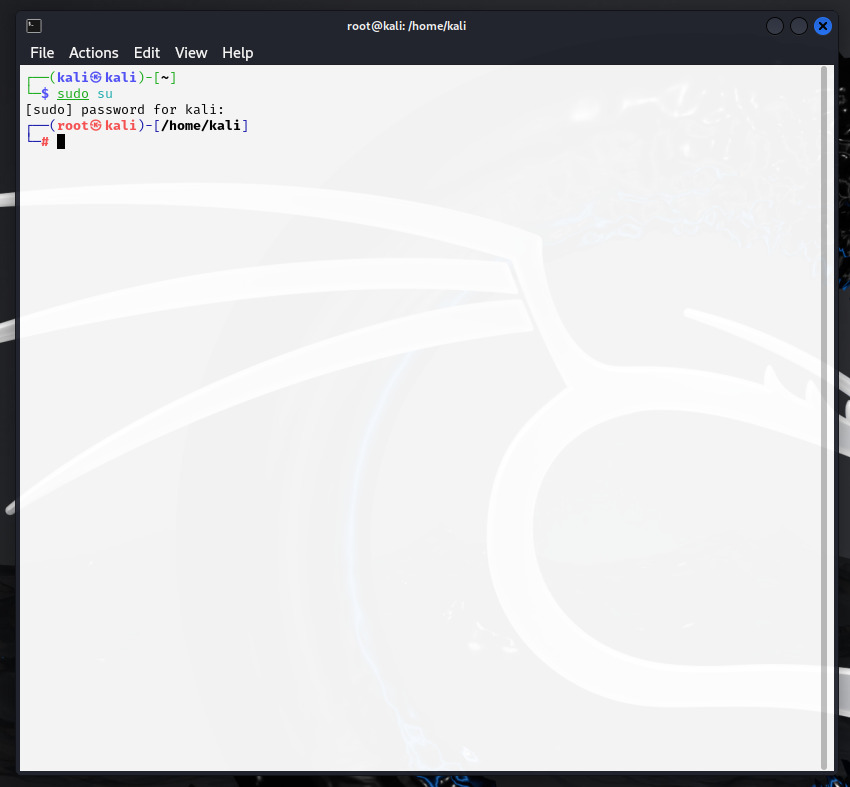
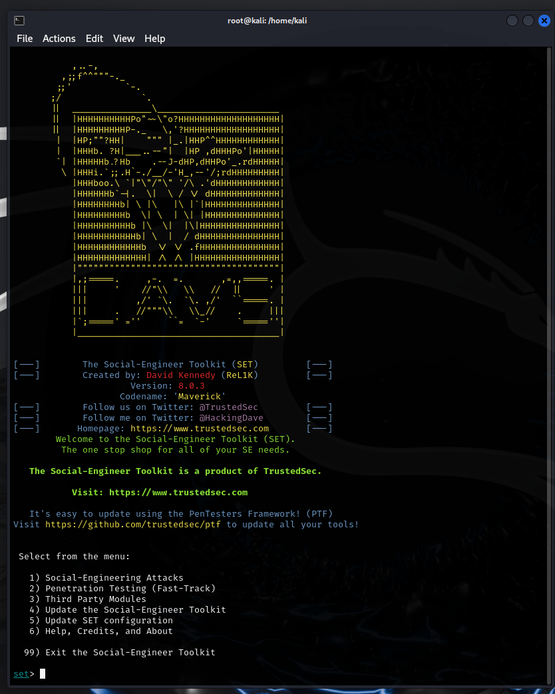
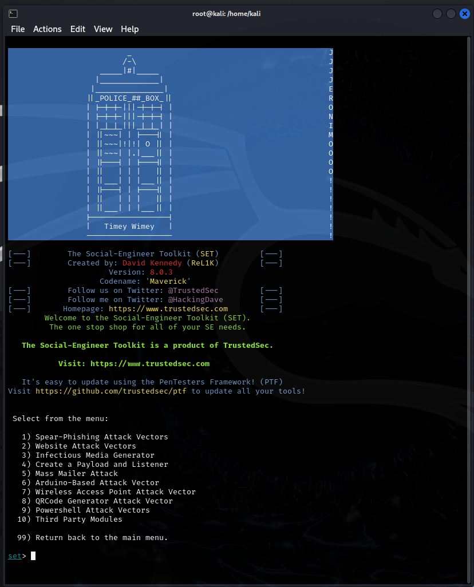
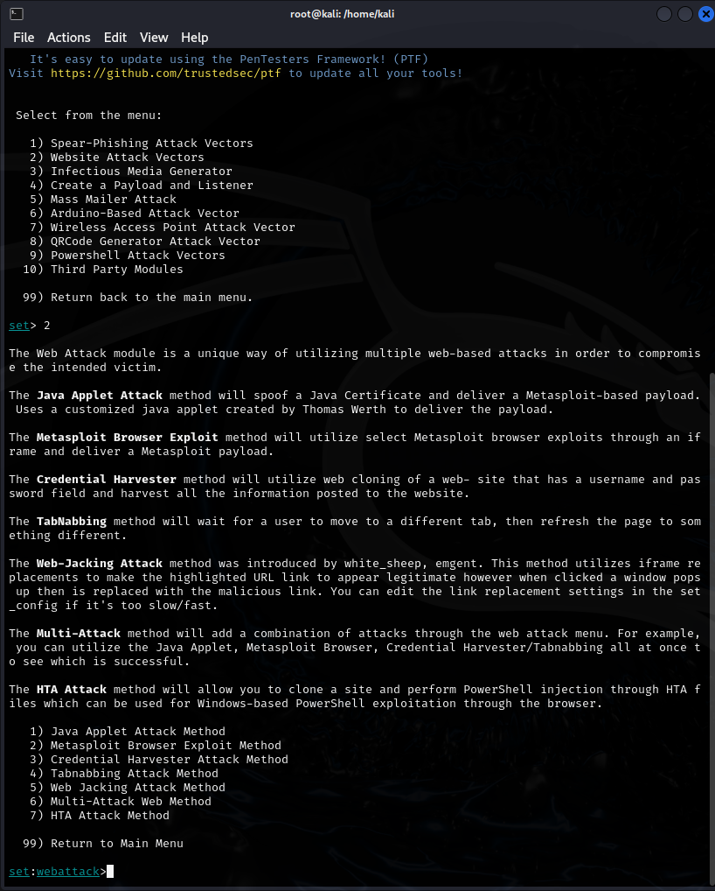
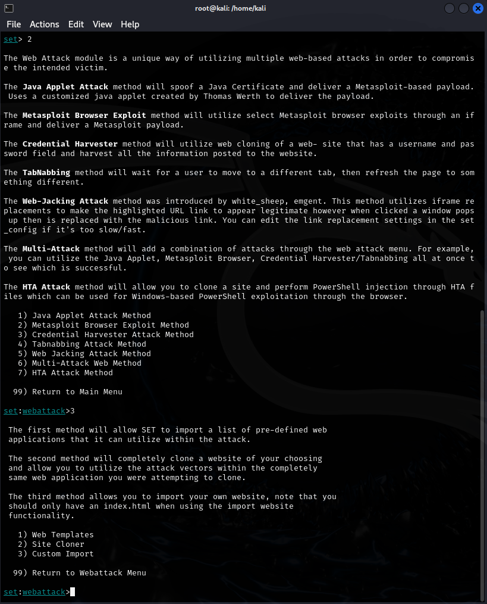
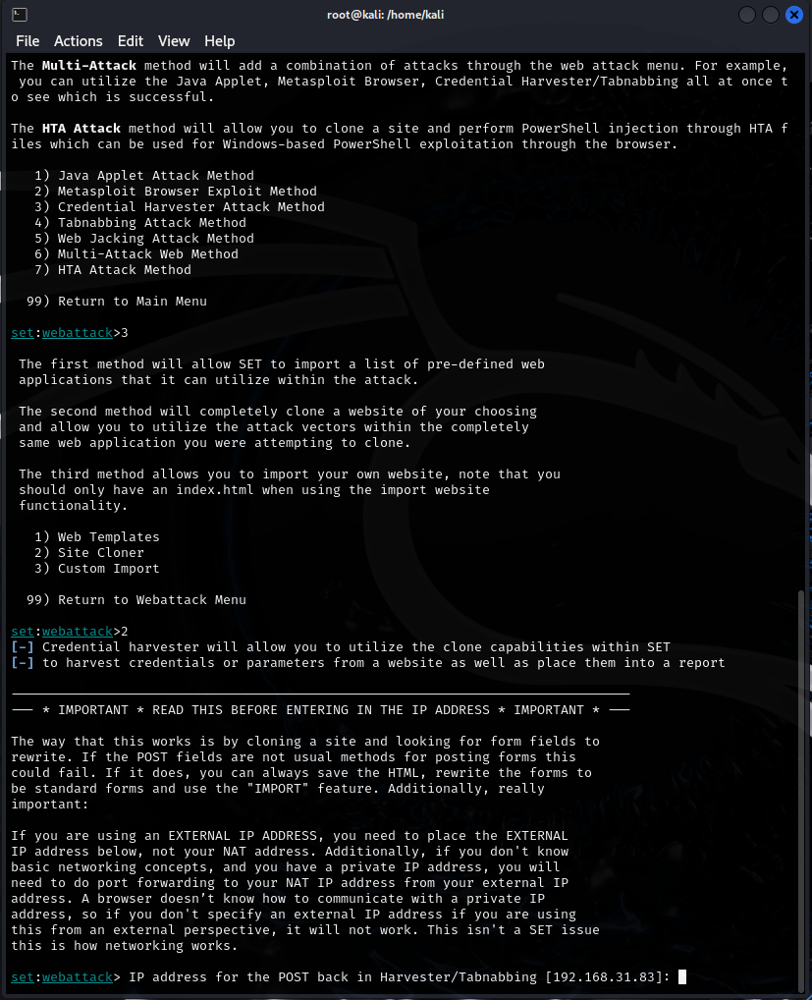
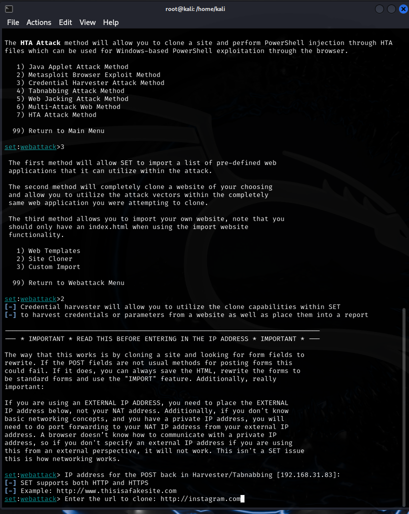
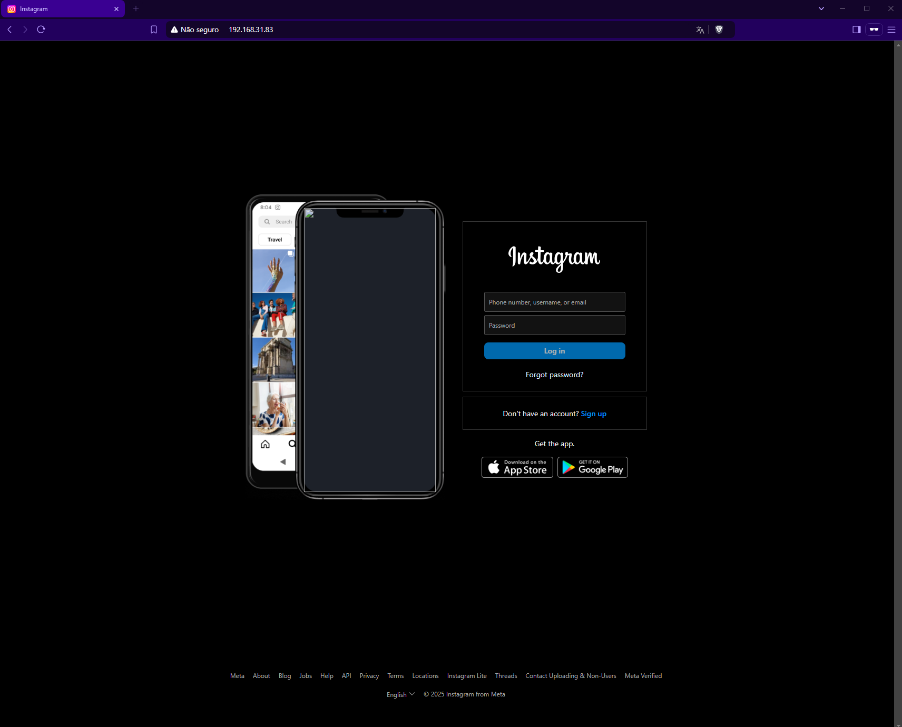
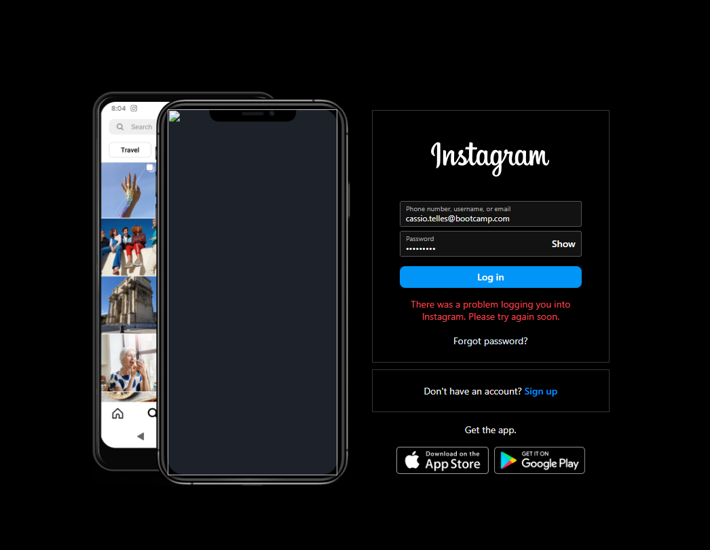
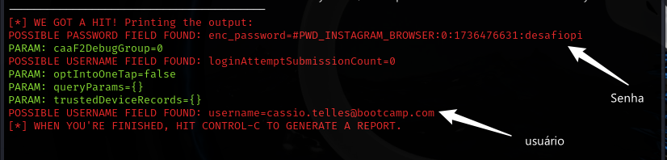

# BootCamp CiberSecurity Dio Santander

## Comandos utilizados com Prints

1. Abrindo Terminal no KaliLinux em modo root, utiluzando o comando ```sudo su```



2. Iniciando o setoolkit: ``` setoolkit ```



3. Selecionado o Tipo de ataque: ``` Social-Engineering Attacks ```



4. Selecionado o Vetor de ataque: ``` Web Site Attack Vectors ```



5. Selecionado Método de ataque: ```Credential Harvester Attack Method ```



6. Selecionado Método de ataque: ``` Site Cloner ```, onde mostra o IP local da VM por padrão.



7. URL para clone: http://www.instagram.com - Devido a tentativa de utilizar Facebook apresentar erros.



8. Acessando pelo Navegador Brave o ip da VM 192.168.31.83 e acessando o Clone da Pagina de Login do Instagram.



9. Após inserir os dados de login e clicando em "S"ing In", Aparece para vitima um erro de usuário e com isso ja foi capturado os dados.



10. Dados capturados pelo ``` setoolkit ``` no terminal.


